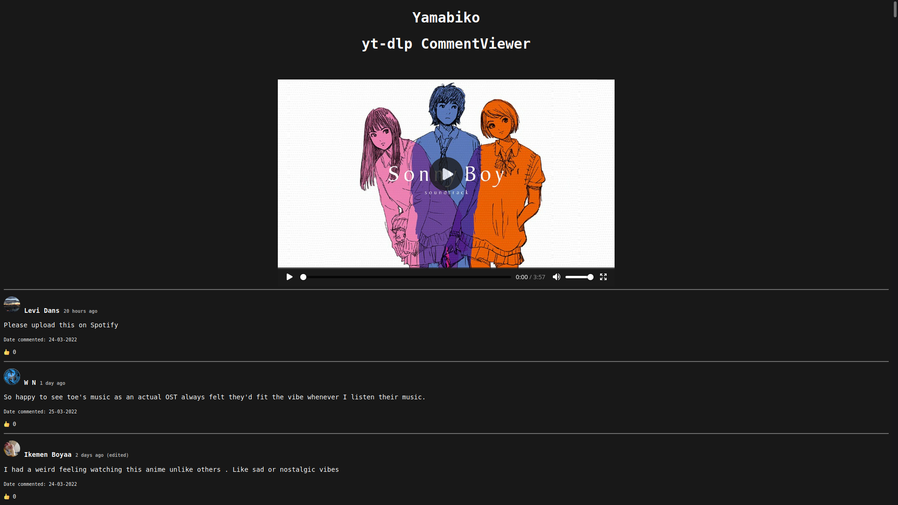

# Yamabiko - A yt-dlp comment viewer

## General info

Yamabiko turns the comments from the JSON file, downloaded with yt-dlp into a viewable, human-readable HTML page. The downloaded video file can also be shown on the page.

## Requirements

* [Python 3](https://www.python.org/downloads/)
* [yt-dlp](https://github.com/yt-dlp/yt-dlp)

## How to use

Download the Youtube video with the comments file (JSON)

```
yt-dlp --write-comments "https://youtubeVideo.url"
```

After that run Yamabiko with Python and declare the JSON file

for ease of use drag and drop the JSON file into the terminal when you have to enter the name (◠‿◠✿)

```
python3 yamabiko.py -i filename.json
```

or if you want to have the video on the page center

```
python3 yamabiko.py -i filename.json -v filename.mp4
```

After you should have a HTML file called **'index.html'**

Open it and HEYYYヽ(o＾▽＾o)ノ it's working (hopefully).



**NOTICE: When drag and dropping the JSON and video file the whole path gets entered, meaning you can move the index.html around.**

## TODO / Fixing

- [ ] Downloading stuff that gets pulled online
- [ ] It's sorted after date posted / Add sorting after likes, etc.
- [ ] Reply of comments are just shown under each other
- [ ] Other stuff which I do not care about ❤（っ＾▿＾)

## Commits

Help is very much appreciated since I don't really want to work on this too much. Just create an Issue, fork it send a PR and I'll check it or even change everything completely! I don't really care that much ┐(︶▽︶)┌